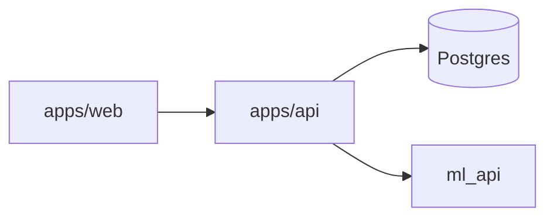

# AI Fitness Platform

## Overview

AI Fitness Platform to monorepo for trenerzy personalni: panel web, API z RBAC, oraz serwis ML do predykcji progresu. Projekt łączy web UI, backend, pipeline ML i inference przez FastAPI.

## Features

- JWT auth + RBAC (ADMIN, TRAINER, CLIENT)
- CRUD klientów, planów i check-inów
- Web UI z protected routes i MVP token storage
- ML training pipeline + FastAPI inference
- Docker Compose for Postgres and ML API

## Tech Stack

- Web: Next.js, TypeScript, Tailwind
- API: Express, Prisma, PostgreSQL
- ML: scikit-learn, FastAPI
- Tooling: Docker, Vitest, Playwright

## Architecture



More details: `docs/architecture.md`.

## Quickstart

### Prerequisites

- Node.js 20+
- Docker (for Postgres + ML API)

### Run services

```bash
docker compose up -d postgres ml_api
```

### Install deps

```bash
npm install
```

### Migrate + seed

```bash
npm run prisma:migrate --workspace apps/api
npm run prisma:seed --workspace apps/api
```

### Start dev

```bash
npm run dev
```

- Web: http://localhost:3000
- API: http://localhost:4000
- ML API: http://localhost:8000

## Demo credentials

- trainer@demo.com / Demo1234!

## API summary

See `docs/api.md` for full list. Core endpoints:

- `POST /auth/login`
- `GET /auth/me`
- `GET /clients`
- `POST /clients`
- `GET /clients/:id/plans`
- `GET /clients/:id/checkins`
- `GET /ml/health`
- `POST /ml/predict-weight`

## ML

Train a model (Etap 7):

```bash
cd ml
python -m src.train
```

## Production Docker (optional)

```bash
docker compose -f docker-compose.prod.yml up -d
```

Services:

- Web: http://localhost:3000
- API: http://localhost:4000
- ML API: http://localhost:8000

## Troubleshooting

- CORS: ensure `CORS_ORIGIN=http://localhost:3000` in `apps/api/.env`.
- Ports in use: adjust `PORT` (API) or `NEXT_PUBLIC_API_BASE_URL` (web).
- ML API errors: verify `ml/artifacts/model.pkl` exists.

## Roadmap

- Etap 10: programy treningowe + raporty
- Etap 11: diet coaching + alerts
- Etap 12: personalized ML insights

## Docs

- `docs/architecture.md`
- `docs/api.md`
- `docs/screenshots.md`
