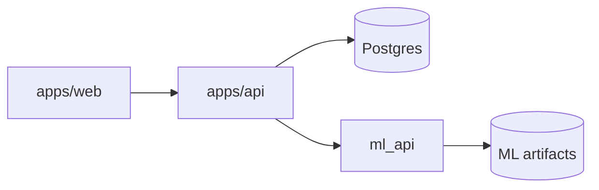
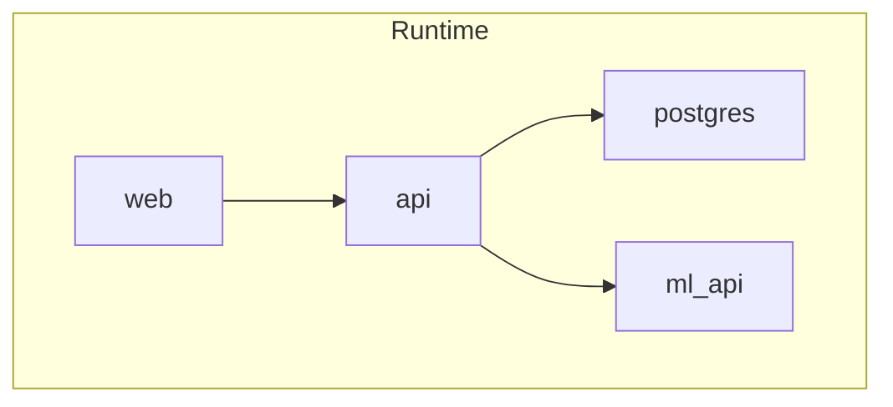

# Architecture

## System overview

## Runtime services

## Notes

- Web uses JWT stored in localStorage (MVP).
- API enforces RBAC for trainer/admin roles.
- ML inference happens via HTTP to the FastAPI service.
